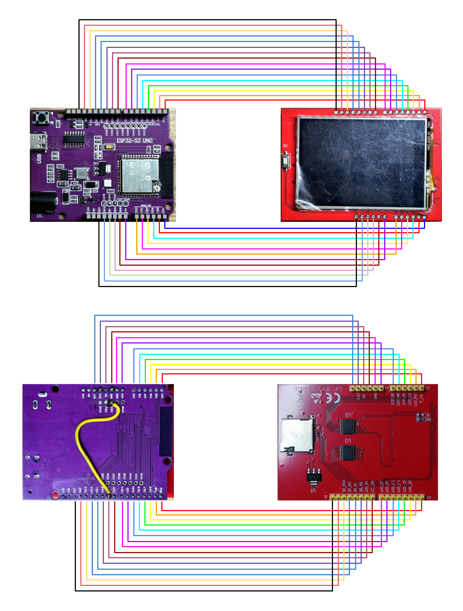

---

# **ESP32 Weather Clock**

This document details the construction of a desktop **weather clock** using an **ESP32 microcontroller** and a **2.4-inch ILI9341 TFT LCD** display. The device shows the current time, date, and weather, as well as a weather forecast.

## **Materials Used**

### **1\. ESP32 Development Board**

I'm using an **UNO-compatible ESP32-S3 board**, which has the same form factor as an Arduino UNO. This allows for easy integration with UNO-compatible shields.

### **2\. 2.4-inch TFT LCD with ILI9341 Driver**

The **2.4-inch TFT LCD** with an **ILI9341 driver** is designed as an UNO shield. To connect it to the ESP32, a jumper wire is needed between **GPIO46** and **GPIO15** on the ESP32 board. This enables the display to be used as a shield by simply stacking the two boards.

The following pins are used for the parallel interface:

C++

// The ESP32 and TFT the pins used for testing are:  
\#**define** TFT\_CS    6   // Chip select control pin  
\#**define** TFT\_DC    7   // Data Command control pin  
\#**define** TFT\_RST   5   // Reset pin

\#**define** TFT\_WR    1   // Write strobe control pin  
\#**define** TFT\_RD    2   // Read strobe control pin

\#**define** TFT\_D0    21  // Must use pins in the range 0-31 for the data bus  
\#**define** TFT\_D1    15  
\#**define** TFT\_D2    18  
\#**define** TFT\_D3    17  
\#**define** TFT\_D4    19  
\#**define** TFT\_D5    20  
\#**define** TFT\_D6    03  
\#**define** TFT\_D7    14

### **3\. Simple wiring**

The wiring I’m using here is for UNO shaped ESP32 board and UNO shield shaped tft LCD board. I just simply sandwiched them together and added jumper between IO46 and IO15 in on the ESP32 board because the library suggests keeping the parallel data pin using the first 32 IO of the ESP32. 

---

## **Software and Libraries**

### **Arduino IDE**

The project uses the **Arduino IDE** for programming. Make sure to properly configure the ESP32 board settings and install the necessary libraries via the Library Manager.

### **Libraries Used**

The following libraries are required for this project:

* **PNGdec** by Larry Bank  
* **TFT\_eSPI** by Bodmer  
* **ArduinoJson** by Benoit

If you are new to the **TFT\_eSPI** library, please read its **readme file** for setup instructions. A pre-configured User\_Setup.h file for a parallel ILI9341 display is included in the project repository to match my setup.

⚠️ **Note:** Due to the memory requirements of these libraries, you may need to **expand the flash memory** in your Arduino IDE settings.

---

## **API Integration**

### **1\. NTP Server**

No API key is needed for the **Network Time Protocol (NTP)** server. Simply ensure the server addresses in the code are **valid and active**.

### **2\. OpenWeatherMap API**

The weather information is sourced from **https://openweathermap.org/**.

1. Create an account on the website to obtain your **API key**.  
2. Replace the placeholder value for the apiKey string in the "Weather API" section of the Arduino sketch with your personal key.  
3. Define your desired location by changing the city string. Ensure the city name is correctly registered with OpenWeatherMap.
